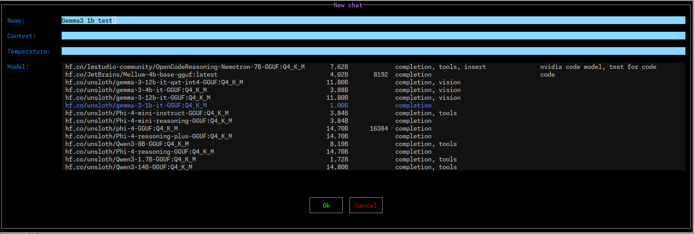

# BOllama

Simple Ollama TUI


## Chat


## Local models


## Running models


# Why Bollama?

Bollama is meant to be simple, an easy way to quickly test various ollama models.
Most of the other UIs and CLIs I've used were more focused on longer term use of a model than quick testing.

If you need something small and simple then Bollama may be worth a try. Otherwise there are many other options that will probably suit you better.


# Installation

There are pre-built binaries for Linux and Windows available on the releases page

Building from source is also straightforward if you have a working haskell environment. (GHC 9.12.2+ and cabal)


# Usage

- Extract one of the prebuilt binaries from the release archive
- Rename to `bollama` (or `bollama.exe` on Windows)
- Make it executable (Linux)
- Run with no arguments

By default you'll start on the Models tab, which shows the list of models available on the local Ollama server.

You'll need to install at least one model to use chat etc. `ollama pull <model>` is the command to do this.

## Usage tips

### On the models page

 - You can press `t` to use the current model in a temporary chat (opens in the `#Temp` chat)
 - You can press `n` to start a new chat with the current model

### New chat



 - Enter the chat name, tab to `Ok` and press enter
 - You can change the temperature, context and the model to use. Or leave them as is for the defaults


### Chats tab

 - Press `Ctrl-s` to send the current message
 - Press `Ctrl-c` to cancel the current model
 - Press `Ctrl-t` to toggle show thinking
 - Press `Ctrl-p` to toggle show message statistics


### PS tab

 - Press `s` to stop the selected model


---

### Global Keys

- `Ctrl-q` => quit application
- `Ctrl-u` => update theme from config file
- `F1` => help
- `F2` => Models tab
- `F3` => Running/PS tab
- `F4` => Chat tab
- `F11` => Supported colour names
- `F12` => Debug log


See the in app help (F1) for more details.


# Here is the in app help (F1) as text for reference

NB this is formatted better in the app itself, this is here for reference only


---
---
---

<!-- FROM APP -->


# Bollama

<div style='margin-left: 15px'>

Bollama is a simple TUI for Ollama.
  version: 0.1.0.16 beta


### Global Shortcuts

| key | action |
| --- | --- |
| Ctrl-q | quit application |
| Ctrl-u | update theme from config file |
| F1 | help |
| F2 | Models tab |
| F3 | Running/PS tab |
| F4 | Chat tab |
| F11 | Supported colour names |
| F12 | Debug log |


</div>


---

# Tabs

<div style='margin-left: 15px'>

## Models

<div style='margin-left: 15px'>

Shows the list of models available in the Ollama server sorted by parameter size.
Shows the number of parameters, model size, capabilities, etc where available.
You can also add a comment to a model


### Model Shortcuts

| key | action |
| --- | --- |
| c | Edit user comment for the model |
| * | Set the model as the default for new temp chats |
| d | Delete the model |
| / | Filter models |
| F5 | Refresh the model list |
| t | Use the `#Temp` chat with the selected model |
| n | Start a new chat with the selected model |


</div>


---

## PS

<div style='margin-left: 15px'>

Shows the list of running models.


### PS Shortcuts

| key | action |
| --- | --- |
| s | Stop selected model.  (Sends a TTL of 0) |


</div>


---

## Chat

<div style='margin-left: 15px'>

Shows the list of chats.


### Chat Shortcuts - global

| key | action |
| --- | --- |
| F10 | Context menu |
| Ctrl-n | New chat. Start name with `#` for a temporary chat |
| Ctrl-e | Edit chat name & model |
| Ctrl-t | Toggle show thinking |
| Ctrl-p | Toggle show message details |
| Ctrl-c | Cancel current chat, assuming LLM is streaming a response |
| PgUp | Scroll chat history up |
| PgDown | Scroll chat history down |
| Ctrl-PgUp | Scroll chat history to top |
| Ctrl-PgDown | Scroll chat history to end |


Note that when editing a chat, you may not change from a temp chat to a non-temp chat or vice versa.


### Chat Shortcuts - chat input

| key | action |
| --- | --- |
| Ctrl-s | Send the current message |


### Chat Shortcuts - chats list

| key | action |
| --- | --- |
| * | Set as the default chat |


</div>


---

## Colours

<div style='margin-left: 15px'>

Shows the list of known colour names available for use in the TUI theme
See *Themes* below


</div>


---

## Log

<div style='margin-left: 15px'>

Shows the log of events.


</div>


---


</div>


---

# Configuration and State

<div style='margin-left: 15px'>

There are two configuration files
  1. theme.csv
  2. config.json

  For linux config is in ~/.config/bollama/

The bollama state is stored in a sqlite database.
  For linux this is usually ~/.local/share/bollama/bollama.db

## Theme

<div style='margin-left: 15px'>

You can change the default theme by creating a file called `theme.csv` in the Bollama config directory.
 For linux this is usually ~/.config/bollama/theme.csv

The theme is a CSV file with the following format:

```

  <name>,<fg>,<bg>,<attr>
  <name>,<fg>,<bg>
  <name>,<fg>


```


Where:

```

  <name> is the name of the attribute
  <fg> is the foreground colour name
  <bg> is the background colour name
  <attr> is an optional attribute (bold, dim, reverse, underline)


```


- Attributes are optional, and one one of
    - standout
    - underline
    - reverseVideo
    - blink
    - dim
    - bold
    - bright
    - italic
    - strikethrough
    - `-` means default

- colours are either a #hex-code or a name. Known names are show on the `Colours` tab
    See https://rich.readthedocs.io/en/stable/appendix/colors.html
- true colour is supported if your terminal supports it and has the correct terminfo 
    (e.g `TERM=tmux-256color` or `TERM=xterm-256color` and `COLORTERM=truecolor`).
    See https://github.com/termstandard/colors


Here is the default theme

<div style='margin-left: 10px'>


    --default                    , red                   ,  blue
    borderSelectedLabel        , violet                ,  -
    chatMsgA                   , black                 ,  #707070
    chatMsgB                   , black                 ,  #a0a0a0
    chatMsgSelected            , black                 ,  -
    chatDefaultMarker          , yellow                ,  -
    colHeader                  , deep_sky_blue2        ,  -                   , bold
    editAttr                   , black                 ,  grey
    editFocusedAttr            , black                 ,  sky_blue1
    footer                     , black                 ,  grey
    footerMessage              , black                 ,  grey
    footerTitle                , white                 ,  black
    infoTitle                  , cyan                  ,  -
    listAttr                   , white                 ,  grey7
    listSelectedAttr           , cornflower_blue       ,  -
    listSelectedFocusedAttr    , black                 ,  cornflower_blue
    msgError                   , red                   ,  -
    msgInfo                    , black                 ,  blue
    spinner1                   , light_sky_blue1       ,  -
    spinner2                   , deep_pink3            ,  -
    tabFooter                  , black                 ,  grey
    tabSelected                , black                 ,  cornflower_blue
    tabUnselected              , black                 ,  grey
    time                       , yellow                ,  -
    version                    , yellow                ,  grey
    copyText                   , dark_green            ,  #909090

    msgDetailBlock             , white                 , black
    msgDetailTitle             , green                 , black                , bold
    msgDetailText              , tan                   , black

    popup                      , black                 ,  pale_turquoise4
    popupHeader                , blue3                 ,  pale_turquoise4
    popupButtonOk              , green                 ,  black
    popupButtonOkFocused       , black                 ,  green
    popupButtonCancel          , red                   ,  black
    popupButtonDisabled        , black                 ,  grey35
    popupButtonDisabledFocused , black                 ,  grey
    popupButtonCancelFocused   , black                 ,  red
    popupTableHeader           , deep_pink4            ,  pale_turquoise4

    popupError                 , black                 ,  red3
    popupErrorText             , black                 ,  red3

    popupHelp                  , grey                  ,  black
    helpH1                     , black                 ,  violet              , bold
    helpH2                     , black                 ,  gold3               , bold
    helpKeyTitle               , green                 ,  black
    helpKeyShortcut            , green                 ,  black
    helpKeyAction              , grey                  ,  black

    invalidFormInputAttr       , black                 ,  red

    radio                      , cornflower_blue       ,  -
    radioFocused               , black                 ,  cornflower_blue


    -- fileBrowserAttr
    -- fileBrowserCurrentDirectoryAttr
    -- fileBrowserSelectionInfoAttr
    -- fileBrowserSelectedAttr
    -- fileBrowserDirectoryAttr
    -- fileBrowserBlockDeviceAttr
    -- fileBrowserRegularFileAttr
    -- fileBrowserCharacterDeviceAttr
    -- fileBrowserNamedPipeAttr
    -- fileBrowserSymbolicLinkAttr
    -- fileBrowserUnixSocketAttr


</div>


</div>


---

## Config

<div style='margin-left: 15px'>

The config is a JSON file.
It looks something like this

```

{
    "avoid_emojis": false,
    "default_tab": "chat",
    "ollama_url": "http://localhost:11434",
    "allow_mouse": "true",
    "default_export_dir": "/home/user/temp"
}


```


</div>


---


</div>


---

