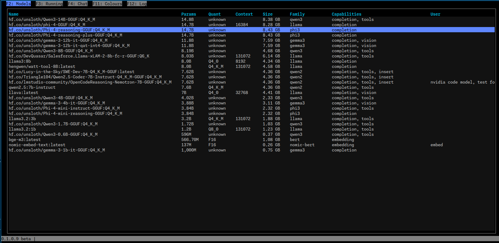
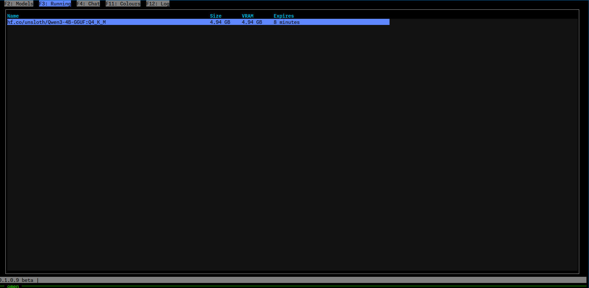
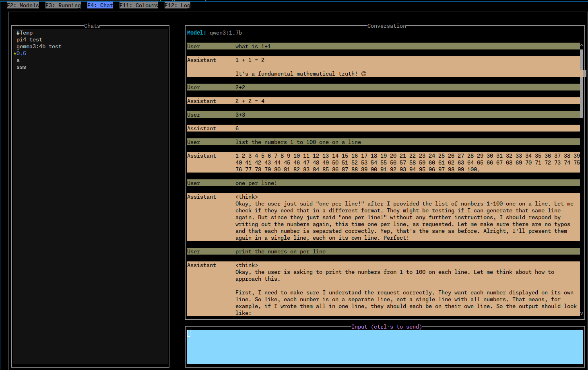

# BOllama

Simple Ollama TUI

---

### Global Keys

- `Ctrl-q` => quit application
- `Ctrl-u` => update theme from config file
- `F1` => help
- `F2` => Models tab
- `F3` => Running/PS tab
- `F4` => Chat tab
- `F11` => Supported colour names
- `F12` => Debug log


# Models



Shows all installed ollama models.
Sorted by parameter size


### Keys

- `c`   => Edit user comment for the model
- `*`   => Set the model as the default for new temp chats
- `d`   => Delete the model
- `/`   => Filter models
- `F5`  => Refresh the model list


# PS



Shows current running models


### Keys

- `s`  => Stop selected model.  (Sends a TTL of 0)


# Chat



LLM chats


### Keys

- `tab`  => Switch between chat input and chats list
- `Ctrl-n` => New chat. Start name with `#` for a temporary chat
- `Ctrl-e` => Edit chat name & model
- `PageUp` => Scroll chat history up
- `PageDown` => Scroll chat history up
- `Ctrl-PageUp` => Scroll chat history to top
- `Ctrl-PageDown` => Scroll chat history to end

### Keys while editing chat input

- `Ctrl-s` or `Ctrl-r` or `F5` => Send the input to the LLM


### Keys while on the chats list

- `*` Set as the default chat


# History

A sqlite DB is created in the state dir

In linux this is `~/.local/share/bollama/bollama.db`


# Config

In the config dir, for linux `~/.config/bollama`


## theme

You can override the default them by creating/editing `theme.csv`

The default values are


```
    --default                    , red                   ,  blue
    borderSelectedLabel        , violet                ,  -
    chatMsgA                   , black                 ,  #707070
    chatMsgB                   , black                 ,  #a0a0a0
    chatMsgSelected            , black                 ,  -
    chatDefaultMarker          , yellow                ,  -
    colHeader                  , deep_sky_blue2        ,  -               , bold
    editAttr                   , black                 ,  grey
    editFocusedAttr            , black                 ,  sky_blue1
    footer                     , black                 ,  grey
    footerMessage              , black                 ,  grey
    footerTitle                , white                 ,  black
    infoTitle                  , cyan                  ,  -
    listAttr                   , white                 ,  grey7
    listSelectedAttr           , cornflower_blue       ,  -
    listSelectedFocusedAttr    , black                 ,  cornflower_blue
    msgError                   , red                   ,  -
    msgInfo                    , black                 ,  blue
    spinner1                   , light_sky_blue1       ,  -
    spinner2                   , deep_pink3            ,  -
    tabFooter                  , black                 ,  grey
    tabSelected                , black                 ,  cornflower_blue
    tabUnselected              , black                 ,  grey
    time                       , yellow                ,  -
    version                    , yellow                ,  grey

    popup                      , black                 ,  pale_turquoise4
    popupHeader                , blue3                 ,  pale_turquoise4
    popupButtonOk              , green                 ,  black
    popupButtonOkFocused       , black                 ,  green
    popupButtonCancel          , red                   ,  black
    popupButtonDisabled        , black                 ,  grey35
    popupButtonDisabledFocused , black                 ,  grey
    popupButtonCancelFocused   , black                 ,  red
    popupTableHeader           , deep_pink4            ,  pale_turquoise4

    popupError                 , black                 ,  red3
    popupErrorText             , black                 ,  red3

    invalidFormInputAttr       , black                 ,  red
```


The CVS file format is `name,foreground,background,attributes`


- All the names are listed above in the example.
- Attributes are optional, and one one of
    - standout
    - underline
    - reverseVideo
    - blink
    - dim
    - bold
    - bright
    - italic
    - strikethrough
    - `-` means default
- colours are either a #hex-code or a name. Known names are show on the `Colours` tab
  See https://rich.readthedocs.io/en/stable/appendix/colors.html
- true colour is supported if your terminal supports it and has the correct terminfo (e.g `TERM=tmux-256color` or `TERM=xterm-256color` and `COLORTERM=truecolor`).
  See https://github.com/termstandard/colors
