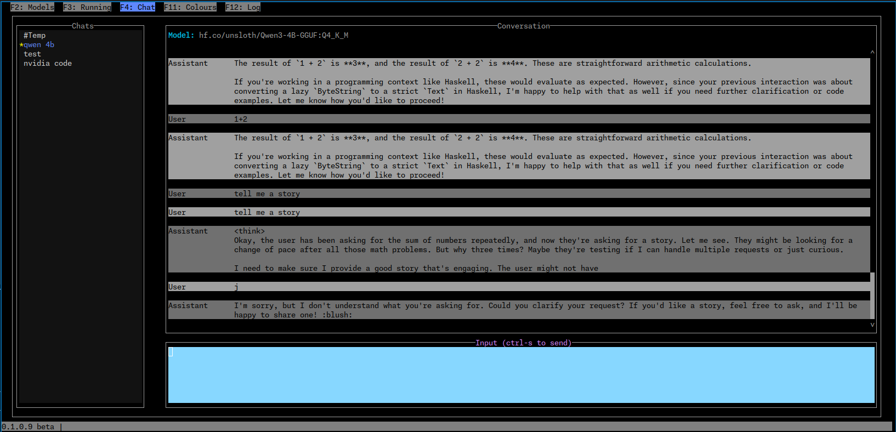

# BOllama

Simple Ollama TUI

---

### Global Keys

- `Ctrl-q` => quit application
- `Ctrl-u` => update theme from config file
- `F1` => help
- `F2` => Models tab
- `F3` => Running/PS tab
- `F4` => Chat tab
- `F11` => Supported colour names
- `F12` => Debug log


# Models


Shows all installed ollama models.
Sorted by parameter size


### Keys

- `t`  => Edit user text for the model
- `*`  => Set the model as the default for new temp chats


# PS


Shows current running models


### Keys

- `s`  => Stop selected model


# Chat



LLM chats


### Keys

- `tab`  => Switch between chat input and chats list
- `Ctrl-n` => New chat. Start name with `#` for a temporary chat
- `Ctrl-e` => Edit chat name & model
- `PageUp` => Scroll chat history up
- `PageDown` => Scroll chat history up
- `Ctrl-PageUp` => Scroll chat history to top
- `Ctrl-PageDown` => Scroll chat history to end

### Keys while editing chat input

- `Ctrl-s` or `Ctrl-r` or `F5` => Send the input to the LLM


### Keys while on the chats list

- `*` Set as the default chat


# History

A sqlite DB is created in the state dir

In linux this is `~/.local/share/bollama/bollama.db`


# Config

In the config dir, for linux `~/.config/bollama`


## theme

You can override the default them by creating/editing `theme.csv`

The default values are


```
    --default                    , red                   ,  blue
    borderSelectedLabel        , violet                ,  -
    chatMsgA                   , black                 ,  wheat4
    chatMsgB                   , black                 ,  tan
    chatMsgSelected            , black                 ,  -
    chatDefaultMarker          , yellow                ,  -
    colHeader                  , deepSkyBlue2          ,  -               , bold
    editAttr                   , black                 ,  grey
    editFocusedAttr            , black                 ,  skyBlue
    footer                     , black                 ,  grey
    footerMessage              , black                 ,  grey
    footerTitle                , white                 ,  black
    infoTitle                  , cyan                  ,  -
    listAttr                   , white                 ,  grey7
    listSelectedAttr           , cornflowerBlue        ,  -
    listSelectedFocusedAttr    , black                 ,  cornflowerBlue
    msgError                   , red                   ,  -
    msgInfo                    , black                 ,  blue
    spinner1                   , lightSkyBlue1         ,  -
    spinner2                   , deepPink3             ,  -
    tabFooter                  , black                 ,  grey
    tabSelected                , black                 ,  cornflowerBlue
    tabUnselected              , black                 ,  grey
    time                       , yellow                ,  -
    version                    , yellow                ,  grey

    popup                      , black                 ,  paleTurquoise4
    popupHeader                , blue3                 ,  paleTurquoise4
    popupButtonOk              , green                 ,  black
    popupButtonOkFocused       , black                 ,  green
    popupButtonCancel          , red                   ,  black
    popupButtonCancelFocused   , black                 ,  red
    popupTableHeader           , deepPink4             ,  paleTurquoise4

    popupError                 , black                 ,  red3
    popupErrorText             , black                 ,  red3
```


The CVS file format is `name,foreground,background,attributes`


- All the names are listed above in the example.
- Attributes are optional, and one one of
    - standout
    - underline
    - reverseVideo
    - blink
    - dim
    - bold
    - bright
    - italic
    - strikethrough
    - `-` means default
- colours are either a #hex-code or a name. Known names are show on the `Colours` tab and here
  - `black`
  - `red`
  - `green`
  - `yellow`
  - `blue`
  - `magenta`
  - `cyan`
  - `white`
  - `brightBlack`
  - `brightRed`
  - `brightGreen`
  - `brightYellow`
  - `brightBlue`
  - `brightMagenta`
  - `brightCyan`
  - `brightWhite`
  - `orange`            => #FAA500
  - `grey`              => #808080
  - `greyA`             => #646464
  - `greyB`             => #5A5A00
  - `skyBlue`           => #87CEEB
  - `slateBlue`         => #6A5ACD
  - `pink`              => #FFC0CB
  - `aquamarine`        => #5FFFD7
  - `aquamarine1`       => #87FFD7
  - `aquamarine3`       => #5FD7AF
  - `blue1`             => #0000FF
  - `blue3`             => #0000AF
  - `blue4`             => #0000D7
  - `blueViolet`        => #5F00FF
  - `cadetBlue`         => #5FAF87
  - `cadetBlue2`        => #5FAFAF
  - `chartreuse1`       => #87FF00
  - `chartreuse2`       => #5FFF00
  - `chartreuse6`       => #87D700
  - `chartreuse3`       => #5FAF00
  - `chartreuse7`       => #5FD700
  - `chartreuse4`       => #5F8700
  - `cornflowerBlue`    => #5F87FF
  - `cornsilk1`         => #FFFFD7
  - `cyan1`             => #00FFFF
  - `cyan2`             => #00FFD7
  - `cyan3`             => #00D7AF
  - `darkBlue`          => #000087
  - `darkCyan`          => #00AF87
  - `darkGoldenrod`     => #AF8700
  - `darkGreen`         => #005F00
  - `darkKhaki`         => #AFAF5F
  - `darkMagenta`       => #870087
  - `darkMagenta2`      => #8700AF
  - `darkOliveGreen1`   => #D7FF5F
  - `darkOliveGreen4`   => #D7FF87
  - `darkOliveGreen2`   => #AFFF5F
  - `darkOliveGreen3`   => #87AF5F
  - `darkOliveGreen6`   => #87D75F
  - `darkOliveGreen5`   => #AFD75F
  - `darkOrange3`       => #AF5F00
  - `darkOrange4`       => #D75F00
  - `darkOrange`        => #FF8700
  - `darkRed`           => #5F0000
  - `darkRed2`          => #870000
  - `darkSeaGreen1`     => #AFFFD7
  - `darkSeaGreen8`     => #D7FFAF
  - `darkSeaGreen2`     => #AFD7AF
  - `darkSeaGreen3`     => #AFFFAF
  - `darkSeaGreen4`     => #87D7AF
  - `darkSeaGreen5`     => #AFD787
  - `darkSeaGreen6`     => #5F875F
  - `darkSeaGreen7`     => #5FAF5F
  - `darkSeaGreen`      => #87AF87
  - `darkSlateGray1`    => #87FFFF
  - `darkSlateGray2`    => #5FFFFF
  - `darkSlateGray3`    => #87D7D7
  - `darkTurquoise`     => #00D7D7
  - `darkViolet`        => #8700D7
  - `darkViolet2`       => #AF00D7
  - `deepPink1`         => #FF0087
  - `deepPink7`         => #FF00AF
  - `deepPink2`         => #FF005F
  - `deepPink3`         => #D7005F
  - `deepPink5`         => #D70087
  - `deepPink4`         => #5F005F
  - `deepPink6`         => #87005F
  - `deepPink8`         => #AF005F
  - `deepSkyBlue1`      => #00AFFF
  - `deepSkyBlue2`      => #00AFD7
  - `deepSkyBlue3`      => #0087AF
  - `deepSkyBlue4`      => #0087D7
  - `deepSkyBlue5`      => #005F5F
  - `deepSkyBlue6`      => #005F87
  - `deepSkyBlue7`      => #005FAF
  - `dodgerBlue1`       => #0087FF
  - `dodgerBlue2`       => #005FFF
  - `dodgerBlue3`       => #005FD7
  - `gold1`             => #FFD700
  - `gold3`             => #AFAF00
  - `gold4`             => #D7AF00
  - `green1`            => #00FF00
  - `green3`            => #00AF00
  - `green4`            => #00D700
  - `green5`            => #008700
  - `greenYellow`       => #AFFF00
  - `grey0`             => #000000
  - `grey100`           => #FFFFFF
  - `grey11`            => #1C1C1C
  - `grey15`            => #262626
  - `grey19`            => #303030
  - `grey23`            => #3A3A3A
  - `grey27`            => #444444
  - `grey30`            => #4E4E4E
  - `grey35`            => #585858
  - `grey37`            => #5F5F5F
  - `grey39`            => #626262
  - `grey3`             => #080808
  - `grey42`            => #6C6C6C
  - `grey46`            => #767676
  - `grey50`            => #808080
  - `grey53`            => #878787
  - `grey54`            => #8A8A8A
  - `grey58`            => #949494
  - `grey62`            => #9E9E9E
  - `grey63`            => #AF87AF
  - `grey66`            => #A8A8A8
  - `grey69`            => #AFAFAF
  - `grey70`            => #B2B2B2
  - `grey74`            => #BCBCBC
  - `grey78`            => #C6C6C6
  - `grey7`             => #121212
  - `grey82`            => #D0D0D0
  - `grey84`            => #D7D7D7
  - `grey85`            => #DADADA
  - `grey89`            => #E4E4E4
  - `grey93`            => #EEEEEE
  - `honeydew2`         => #D7FFD7
  - `hotPink2`          => #D75FAF
  - `hotPink3`          => #AF5F87
  - `hotPink4`          => #D75F87
  - `hotPink`           => #FF5FAF
  - `hotPink5`          => #FF5FD7
  - `indianRed1`        => #FF5F5F
  - `indianRed2`        => #FF5F87
  - `indianRed`         => #AF5F5F
  - `indianRed3`        => #D75F5F
  - `khaki1`            => #FFFF87
  - `khaki3`            => #D7D75F
  - `lightCoral`        => #FF8787
  - `lightCyan1`        => #D7FFFF
  - `lightCyan3`        => #AFD7D7
  - `lightGoldenrod1`   => #FFFF5F
  - `lightGoldenrod2`   => #D7D787
  - `lightGoldenrod4`   => #FFD75F
  - `lightGoldenrod5`   => #FFD787
  - `lightGoldenrod3`   => #D7AF5F
  - `lightGreen`        => #87FF5F
  - `lightGreen2`       => #87FF87
  - `lightPink1`        => #FFAFAF
  - `lightPink3`        => #D78787
  - `lightPink4`        => #875F5F
  - `lightSalmon1`      => #FFAF87
  - `lightSalmon3`      => #AF875F
  - `lightSalmon4`      => #D7875F
  - `lightSeaGreen`     => #00AFAF
  - `lightSkyBlue1`     => #AFD7FF
  - `lightSkyBlue3`     => #87AFAF
  - `lightSkyBlue4`     => #87AFD7
  - `lightSlateBlue`    => #8787FF
  - `lightSlateGrey`    => #8787AF
  - `lightSteelBlue1`   => #D7D7FF
  - `lightSteelBlue3`   => #AFAFD7
  - `lightSteelBlue`    => #AFAFFF
  - `lightYellow3`      => #D7D7AF
  - `magenta1`          => #FF00FF
  - `magenta2`          => #D700FF
  - `magenta5`          => #FF00D7
  - `magenta3`          => #AF00AF
  - `magenta4`          => #D700AF
  - `magenta6`          => #D700D7
  - `mediumOrchid1`     => #D75FFF
  - `mediumOrchid2`     => #FF5FFF
  - `mediumOrchid3`     => #AF5FAF
  - `mediumOrchid`      => #AF5FD7
  - `mediumPurple1`     => #AF87FF
  - `mediumPurple2`     => #AF5FFF
  - `mediumPurple5`     => #AF87D7
  - `mediumPurple3`     => #875FAF
  - `mediumPurple6`     => #875FD7
  - `mediumPurple4`     => #5F5F87
  - `mediumPurple`      => #8787D7
  - `mediumSpringGreen` => #00FFAF
  - `mediumTurquoise`   => #5FD7D7
  - `mediumVioletRed`   => #AF0087
  - `mistyRose1`        => #FFD7D7
  - `mistyRose3`        => #D7AFAF
  - `navajoWhite1`      => #FFD7AF
  - `navajoWhite3`      => #AFAF87
  - `navyBlue`          => #00005F
  - `orange1`           => #FFAF00
  - `orange3`           => #D78700
  - `orange4`           => #5F5F00
  - `orange5`           => #875F00
  - `orangeRed1`        => #FF5F00
  - `orchid1`           => #FF87FF
  - `orchid2`           => #FF87D7
  - `orchid`            => #D75FD7
  - `paleGreen1`        => #87FFAF
  - `paleGreen2`        => #AFFF87
  - `paleGreen3`        => #5FD75F
  - `paleGreen4`        => #87D787
  - `paleTurquoise1`    => #AFFFFF
  - `paleTurquoise4`    => #5F8787
  - `paleVioletRed1`    => #FF87AF
  - `pink1`             => #FFAFD7
  - `pink3`             => #D787AF
  - `plum1`             => #FFAFFF
  - `plum2`             => #D7AFFF
  - `plum3`             => #D787D7
  - `plum4`             => #875F87
  - `purple3`           => #5F00D7
  - `purple4`           => #5F0087
  - `purple5`           => #5F00AF
  - `purple`            => #8700FF
  - `purple6`           => #AF00FF
  - `red1`              => #FF0000
  - `red3`              => #AF0000
  - `red4`              => #D70000
  - `rosyBrown`         => #AF8787
  - `royalBlue1`        => #5F5FFF
  - `salmon1`           => #FF875F
  - `sandyBrown`        => #FFAF5F
  - `seaGreen1`         => #5FFF87
  - `seaGreen4`         => #5FFFAF
  - `seaGreen2`         => #5FFF5F
  - `seaGreen3`         => #5FD787
  - `skyBlue1`          => #87D7FF
  - `skyBlue2`          => #87AFFF
  - `skyBlue3`          => #5FAFD7
  - `slateBlue1`        => #875FFF
  - `slateBlue3`        => #5F5FAF
  - `slateBlue4`        => #5F5FD7
  - `springGreen1`      => #00FF87
  - `springGreen2`      => #00D787
  - `springGreen5`      => #00FF5F
  - `springGreen3`      => #00AF5F
  - `springGreen6`      => #00D75F
  - `springGreen4`      => #00875F
  - `steelBlue1`        => #5FAFFF
  - `steelBlue2`        => #5FD7FF
  - `steelBlue3`        => #5F87D7
  - `steelBlue`         => #5F87AF
  - `tan`               => #D7AF87
  - `thistle1`          => #FFD7FF
  - `thistle3`          => #D7AFD7
  - `turquoise2`        => #00D7FF
  - `turquoise4`        => #008787
  - `violet`            => #D787FF
  - `wheat1`            => #FFFFAF
  - `wheat4`            => #87875F
  - `yellow1`           => #FFFF00
  - `yellow2`           => #D7FF00
  - `yellow3`           => #AFD700
  - `yellow5`           => #D7D700
  - `yellow4`           => #878700
  - `yellow6`         => #87AF00
